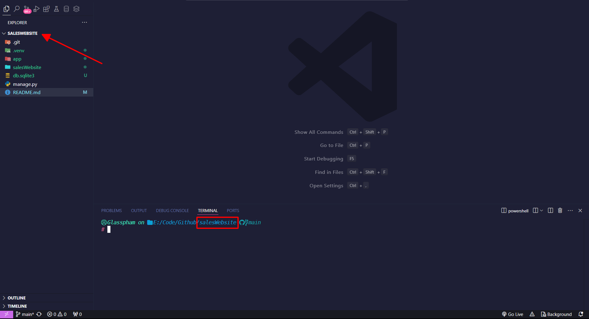
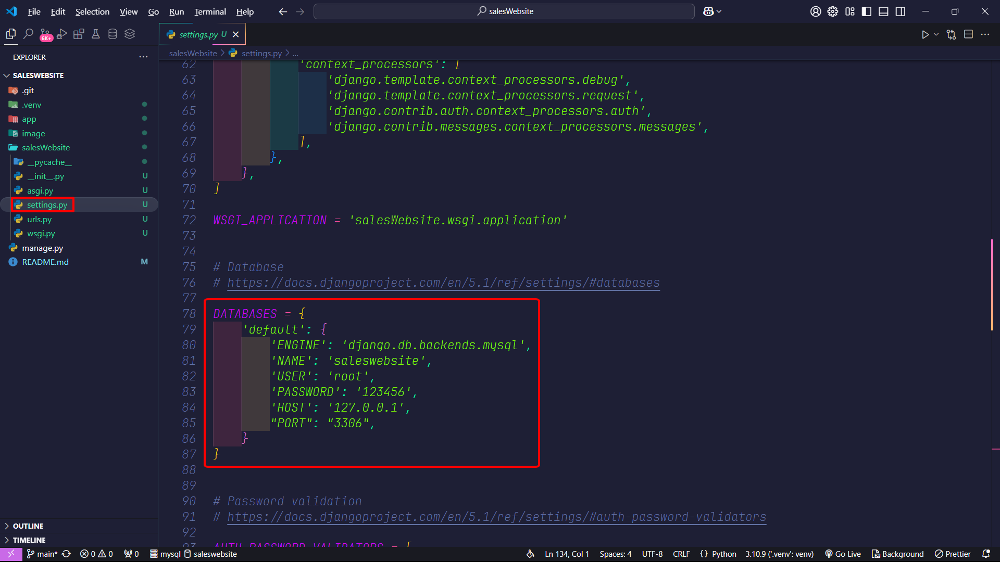

# Website-Django

## Giới thiệu về project

Đây chỉ là 1 project cơ bản, sơ sài, chưa hoàn thiện. Mục đích chỉ là học thử cách làm web bằng [Django](https://www.djangoproject.com/) là framework của [python](https://www.python.org/).

Project mình đa số code theo một kênh youtube là [Gà Python](https://youtube.com/playlist?list=PLUocOGc7RDEIChluBEd5bxuU8Z86-0PyO&si=l2z6-lcmYwH8Fdlk)

## Setup môi trường

Trong folder .venv là folder có sẵn môi trường python và các thư viện cần thiết của cho project này!

_Bước 1:_ mở `Command Promt` hoặc `Terminal` trong [vscode](https://code.visualstudio.com/) và trỏ đúng vào vị trí folder chứa folder .venv



Nếu chưa được như hình bạn có thể dùng lệnh:

```bash
cd folderName
```
_Bước 2:_

_Windows:_

```bash
.venv\Scripts\Activate.ps1
```

_Unix/MacOS:_

```bash
source .venv/Scripts/activate
```

Sau khi môi trường được kích hoạt, bạn sẽ thấy kết quả này trong dấu nhắc lệnh:

_Windows:_

```bash
(myworld) C:\Users\Your Name>
```

_Unix/MacOS:_

```bash
(myworld) ... $
```

Để hiểu rõ hơn bạn có thể tham khảo [w3school](https://www.w3schools.com/django/django_create_virtual_environment.php)

## Xử lý lại database

Tôi đang liên kết với mysql của riêng tôi (như ảnh ở dưới) nên bạn muốn sài được thì bạn phải làm như sau:



_Bước 1:_ Chạy lệnh:

```bash
python manage.py migrate
```

Giúp tạo cơ sở dữ liệu dựa theo các class đã được define

_Bước 2:_ Tạo tài khoản admin, chạy lệnh:

```bash
python manage.py createsuperuser
```

thì tạo tài khoản ban đâu hỏi muốn để chỗ đăng nhập là gì rồi password!

## Vận hành project

Để chạy được chương trình bạn phải làm phần [môi trường](#setup-moi-truong) ở trên. Hãy chạy lệnh:

```bash
python manage.py runserver
```